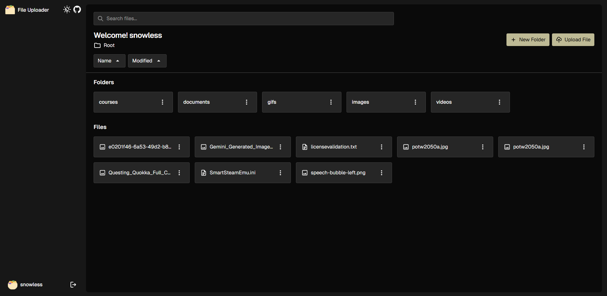
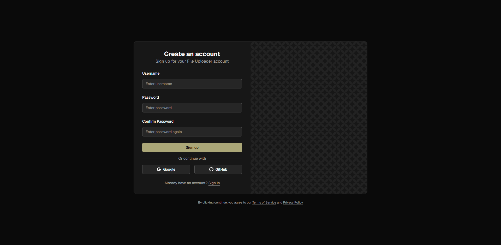

# arnplsrz's File Uploader

An Express.js project built for learning and exploring Prisma ORM integration with Supabase, PostgreSQL, and Passport.js authentication.

**Project link**: [https://file-uploader-82vv.onrender.com](https://file-uploader-82vv.onrender.com)

<table>
  <tr>
    <td colspan="2" align="center">
      
    </td>
  </tr>
  <tr>
    <td width="50%">
      
    </td>
    <td width="50%">
      
    </td>
  </tr>
</table>

## Features

- Session-based authentication with Passport.js
- Folder and file CRUD operations powered by Express.js
- Dark/light theme toggle and responsive design with Tailwind CSS
- Cloud storage integration with Supabase and PostgreSQL

## Technologies Used

- **Frontend:** [Tailwind CSS](https://tailwindcss.com/), [Alpine.js](https://alpinejs.dev/)
- **Backend:** [Node.js](https://nodejs.org/), [Express](https://expressjs.com/), [Supabase](https://supabase.com/)
- **Database:** [PostgreSQL](https://www.postgresql.org/), [Prisma ORM](https://www.prisma.io/)
- **Authentication:** [Passport.js](https://www.passportjs.org/)
- **Deployment:** [Render](https://render.com/), [Aiven](https://aiven.io/)

## Acknowledgments

- [Font Awesome](https://fontawesome.com/) - Comprehensive icon library for UI elements
- [Google Font Icons](https://fonts.google.com/icons) - Material Design icons
- [Hero Patterns](https://heropatterns.com/) - Extensive SVG background patterns
- [Geist Font](https://fonts.google.com/specimen/Geist) - Modern typeface used throughout the project
- [The Odin Project](https://www.theodinproject.com/) - Comprehensive web development curriculum
- [Alpine.js Documentation](https://alpinejs.dev/) - Minimal tool for composing behavior directly in markup
- [Tailwind CSS Documentation](https://tailwindcss.com/docs) - Utility-first CSS framework guidance
- [Prisma Documentation](https://www.prisma.io/docs) - Database toolkit and ORM learning resources
